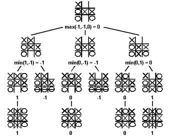

# Tic-Tac-Toe With AI

This is the classic tic-tac-toe game running in cli and written in C++. The
game explores how the basic game AI works. Computers are different from humans
when playing a game. Humans need to analyze opponent's moves, think about strategies,
and use tactics in a game. It is difficult and complicated to program computers in
that way. Computers are better at brute forcing and searching for all the results.

Minimax is the algorithm used in tic-tac-toe AI. All the moves in the game will be
represented as a game tree. The evaluation function will evalute the game results.
The Minimax pretends two players play their best move and search through the
game tree for the worst case scenario and avoid the loss. That is the reason why
the algorithm is called mini (loss) - max (loss) scenario.

The following graph demonstrations best explain the decision making process.



Enjoy the program, have fun to play with it

```bash
make # use make to compile

./play # enjoy the game

start game
*|*|*
*|*|*
*|*|*
== your ==
enter loc: 1 1
*|*|*
*|X|*
*|*|*
== ai\'s ==
O|*|*
*|X|*
*|*|*
== your ==
enter loc: 0 2
O|*|X
*|X|*
*|*|*
== ai\'s ==
O|*|X
*|X|*
O|*|*
```

The graph reference is from [Game Trees](https://www.cs.cmu.edu/~adamchik/15-121/lectures/Game%20Trees/Game%20Trees.html) web page.
